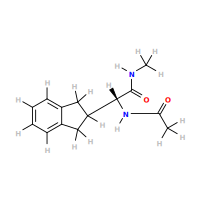
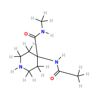
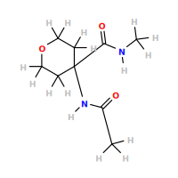
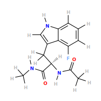
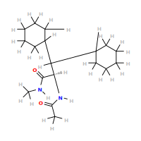

## Non-Canonical Amino Acid DataBase

|   NCAA				            |    Structure										|
| ------------------------------------------------- | ----------------------------------------------------------------------------------------- |
|1-amino-cyclopentane-carboxylic_acid               |  			|
|1-methyl-histidine 				    | 						|
|2,4-dimethyl-phenylalanine 			    | 					|
|2-allyl-glycine 				    | 						|
|2-amino-2-phenylbutyric_acid 			    | 					|
|2-amino-4-bromo-4-pentenoic_acid 		    | 				|
|2-amino-5-phenyl-pentanoic_acid 		    | 				|
|2-amino-heptanoic_acid 			    | 					|
|2-aminomethyl-phenylalanine 			    | 					|
|2-hydroxy-phenylalanine 			    | 					|
|2-indanyl-glycine 				    | 						|
|2-methyl-phenylalanine 			    | 					|
|3-aminomethyl-phenylalanine 			    | 					|
|3-amino-tyrosine 				    |						|
|3-hydroxy-phenylalanine 			    | 					|
|3-hydroxy-tyrosine 				    | 						|
|3-methyl-histidine 				    |						|
|3-methyl-phenylalanine 			    | 					|
|4,5-dehydro-leucine 				    | 						|
|4-aminomethyl-phenylalanine 			    | 					|
|4-amino-phenylalanine 				    |						|
|4-amino-piperidine-4-carboxylic_acid 		    | 				|
|4-amino-tetrahydropyran-4-carboxylic_acid 	    | 			|
|4-amino-tetrahydrothiopyran-4-carboxylic_acid 	    | 		|
|4-carboxy-phenylalanine 			    | 					|
|4-fluoro-tryptophan 				    | 						|
|4-hydroxy-phenylglycine 			    | 					|    
|4-methyl-phenylalanine 			    | 					|     
|4-methyl-tryptophan 				    | 						|        
|4-phenyl-phenylalanine 			    | 					|     
|4-tert-butyl-phenylalanine 			    | 					| 
|5-bromo-tryptophan 				    | 						|         
|5-chloro-tryptophan 				    | 						|        
|5-fluoro-tryptophan 				    | 						|        
|5-hydroxy-tryptophan 				    | 						|       
|5-methyl-tryptophan 				    | 						|        
|6-bromo-tryptophan 				    | 						|         
|6-chloro-tryptophan 				    | 						|        
|6-fluoro-tryptophan 				    | 						|        
|6-methyl-tryptophan 				    | 						|        
|7-azatryptophan 				    | 						|            
|7-bromo-tryptophan 				    | 						|         
|7-methyl-tryptophan 				    | 						|        
|a-aminoadipic_acid 				    | 						|         
|a-amino-glycine 				    | 						|            
|a,B-diaminopropionic_acid 			    | 					|  
|allo-threonine 				    | 						|             
|a-methyl-3-hydroxy-tyrosine 			    | 					|
|a-methyl-histidine 				    | 						|         
|a-methyl-leucine 				    | 						|           
|a-methyl-phenylalanine 			    | 					|     
|a-methyl-tryptophan 				    | 						|        
|a-methyl-tyrosine 				    | 						|          
|a-methyl-valine 				    | 						|            
|amino-butyric_acid 				    |						|         
|amino-ethyl-cysteine 				    | 						|       
|aminoiso-butyric_acid 				    | 					|      
|a,y-diaminobutyric_acid 			    | 					|    
|B-(1-naphthyl)-alanine 			    |-alanine/ncaa.svg) 					|     
|B-(2-naphthyl)-alanine 		            |-alanine/ncaa.svg) 					|     
|B,B-dicyclohexyl-alanine 			    |					|   
|B,B-diphenyl-alanine 				    | 						|       
|B-chloro-alanine 				    | 						|           				    
|B-cyclohexyl-alanine 				    | 						|       				      
|B-cyclopentyl-alanine 				    | 					|      				     
|B-fluoro-alanine 				    | 						|           
|B-hydroxy-norvaline 				    | 						|        
|B-iodo-alanine 				    | 						|             
|cyclohexyl-glycine 				    | 						|         
|diphenylglycine 				    | 						|            
|dipropyl-glycine 				    | 						|           
|ethionine 					    | 							|                  
|fluoro-leucine 				    | 						|             
|hexafluoro-leucine 				    | 						|         
|homocysteine 					    | 							|               
|homoleucine 					    | 							|                
|homophenylalanine 				    | 						|          
|homoserine 					    | 							|                 
|n-in-methyl-tryptophan				    | 					|     
|norleucine 					    | 							|                 
|norvaline 					    | 							|                  
|ornithine 					    | 							|                  
|penicillamine 					    | 						|              
|phenylglycine 					    | 						|              
|phenyl-serine 					    | 						|              
|tert-butyl-alanine 				    | 						|         
|tert-butyl-cysteine 				    | 						|        
|tert-butyl-glycine 				    | 						|         
|trifluoro-alanine 				    | 						|          
|trifluoro-leucine 				    | 						|          
|4-bromo-phenylalaine 				    | 						|       
|4-iodo-phenylalaine 				    | 						|        
|4-(trifluoromethyl)-l-phenylalanine 		    |-l-phenylalanine/ncaa.svg) 				|
|pentafluoro-L-phenylalanine 			    | 					|
